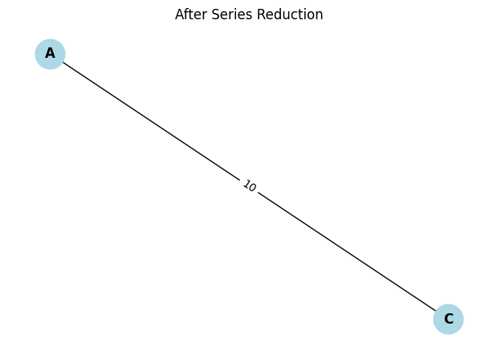
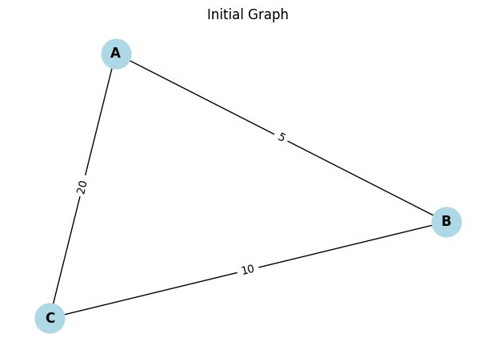

# Problem 1
#  Equivalent Resistance Using Graph Theory

## Motivation

Calculating the equivalent resistance in an electrical circuit is crucial for analyzing and optimizing system performance. Traditional methods become tedious for complex networks, but **graph theory** offers a structured, algorithmic approach.

By modeling circuits as weighted undirected graphs:
- Nodes represent junctions.
- Edges represent resistors (weights = resistance in ohms).

This enables us to reduce circuits using **series** and **parallel** rules systematically—even in nested or cyclic configurations.

---

## Theoretical Background

### Series and Parallel Resistance Rules

#### Series Resistors

If two resistors are connected end-to-end:

$$
R_{eq} = R_1 + R_2
$$

#### Parallel Resistors

If two resistors connect the same pair of nodes:

$$
\frac{1}{R_{eq}} = \frac{1}{R_1} + \frac{1}{R_2} + \dots + \frac{1}{R_n}
$$

---

## Algorithm Description

1. **Input**: A weighted, undirected graph with resistance values on edges.
2. **While** the graph can be simplified:
   - Detect and reduce **series** nodes (degree = 2).
   - Detect and reduce **parallel** edges (multiple between the same nodes).
3. **Output**: The resistance between the two terminals (source and target nodes).

---

## Python Implementation (with NetworkX)

```python
import networkx as nx

def reduce_series(G, node, source, target):
    if G.degree(node) != 2 or node in [source, target]:
        return False
    neighbors = list(G.neighbors(node))
    u, v = neighbors[0], neighbors[1]
    R1 = G[u][node]['resistance']
    R2 = G[v][node]['resistance']
    G.remove_node(node)
    G.add_edge(u, v, resistance=R1 + R2)
    return True

def reduce_parallel(G):
    reduced = False
    edges = list(G.edges(data=True))
    seen = set()
    for u, v, data in edges:
        if (u, v) in seen or (v, u) in seen:
            continue
        parallels = [
            d['resistance'] for _, _, d in G.edges(u, v, data=True)
        ]
        if len(parallels) > 1:
            R_eq = 1 / sum(1 / r for r in parallels)
            G.remove_edges_from(list(G.edges(u, v)))
            G.add_edge(u, v, resistance=R_eq)
            reduced = True
        seen.add((u, v))
    return reduced

def equivalent_resistance(G, source, target):
    G = G.copy()
    while True:
        reduced = False
        for node in list(G.nodes):
            reduced |= reduce_series(G, node, source, target)
        reduced |= reduce_parallel(G)
        if not reduced:
            break
    return G[source][target]['resistance']
```
