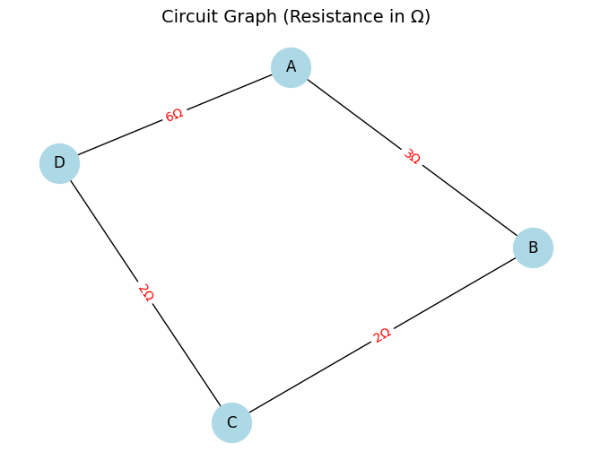

# Problem 1
#  Equivalent Resistance Using Graph Theory

---

## Motivation

Electrical circuits often consist of a complex arrangement of resistors connected in **series**, **parallel**, or even in more complicated **networks with loops** and **branches**. Calculating the **equivalent resistance** between two terminals is a fundamental task in both theoretical and applied physics and electrical engineering.

While simple circuits can be reduced manually, **larger or irregular networks** quickly become tedious and error-prone to simplify by hand. This is where **graph theory** comes in.

By representing the circuit as a **weighted undirected graph**, we can approach the problem in a structured and algorithmic way. Using **Python and NetworkX**, we can:

- Model any resistor network
- Systematically simplify it using graph transformations
- Visualize each reduction step
- Compute the final equivalent resistance programmatically

---

## Theoretical Background

We base our approach on two fundamental rules from circuit analysis:

---

### 1. Series Resistance

Two resistors connected **end-to-end**, where no other branches exist at the node in between, can be replaced with a single resistor:

$$
R_{\text{eq}} = R_1 + R_2
$$

> This applies when the node between the two resistors has **degree 2** and is not a source or target.

---

### 2. Parallel Resistance

When multiple resistors connect **the same pair of nodes**, they are in parallel. They can be replaced by a single resistor using:

$$
\frac{1}{R_{\text{eq}}} = \frac{1}{R_1} + \frac{1}{R_2} + \dots + \frac{1}{R_n}
$$

Or in code:

$$
R_{\text{eq}} = \left( \sum_{i=1}^{n} \frac{1}{R_i} \right)^{-1}
$$

---

These rules are sufficient to reduce any purely resistive network, provided the network is connected and has no dependent elements (like voltage/current sources or reactive components).

---

## Algorithm Description

We use a step-by-step simplification strategy:

1. **Input**: A weighted, undirected graph where:
   - **Nodes** represent junctions
   - **Edges** represent resistors with a `'resistance'` attribute

2. **Reduction Loop**:
   - Find nodes (excluding terminals) with **degree 2** → Apply **series rule**
   - Find **multiple edges** between any pair of nodes → Apply **parallel rule**

3. Continue simplification **until no more changes** are possible.

4. The resulting edge between **source** and **target** contains the equivalent resistance.

---

##  Python Implementation

We implement the reduction rules in Python using the `networkx` library.

```python
import networkx as nx

def reduce_series(G, node, source, target):
    if G.degree(node) != 2 or node in [source, target]:
        return False
    neighbors = list(G.neighbors(node))
    u, v = neighbors[0], neighbors[1]
    R1 = G[u][node]['resistance']
    R2 = G[v][node]['resistance']
    G.remove_node(node)
    G.add_edge(u, v, resistance=R1 + R2)
    return True

def reduce_parallel(G):
    reduced = False
    edges = list(G.edges(data=True))
    seen = set()
    for u, v, data in edges:
        key = frozenset({u, v})
        if key in seen:
            continue
        parallels = [d['resistance'] for _, _, d in G.edges(u, v, data=True)]
        if len(parallels) > 1:
            R_eq = 1 / sum(1 / r for r in parallels)
            G.remove_edges_from(list(G.edges(u, v)))
            G.add_edge(u, v, resistance=R_eq)
            reduced = True
        seen.add(key)
    return reduced

def equivalent_resistance(G, source, target):
    G = G.copy()
    while True:
        reduced = False
        for node in list(G.nodes):
            reduced |= reduce_series(G, node, source, target)
        reduced |= reduce_parallel(G)
        if not reduced:
            break
    return G[source][target]['resistance']
```




