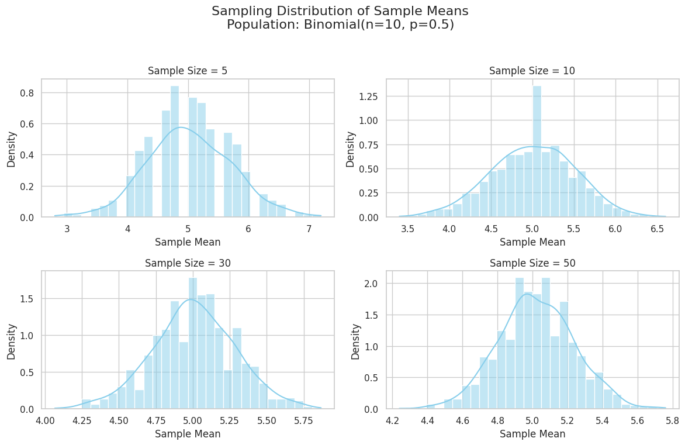

# Problem 1
# Exploring the Central Limit Theorem Through Simulations

## Motivation

The **Central Limit Theorem (CLT)** is a fundamental result in statistics. It states that:
> The distribution of the **sample means** of a sufficiently large number of independent samples drawn from any population will be approximately **normally distributed**, regardless of the population’s original distribution.

This simulation demonstrates how the CLT works using three types of population distributions:
- Uniform
- Exponential
- Binomial

---

## Simulation Plan

### 1. Population Distributions

We generate large populations from:
- Uniform(0, 1)
- Exponential(λ = 1)
- Binomial(n = 10, p = 0.5)

### 2. Sampling Distributions

For each population:
- Take repeated samples of size `n = 5, 10, 30, 50`
- Repeat sampling `1000` times
- Calculate sample means for each trial
- Plot histograms of sample means

### 3. Parameters to Observe

- **Shape convergence**: Does it become bell-shaped?
- **Spread**: Does variance of sample mean decrease with larger sample sizes?

---

## Python Implementation
```python
import numpy as np
import matplotlib.pyplot as plt
import seaborn as sns

sns.set(style="whitegrid")

# Simulation parameters
sample_sizes = [5, 10, 30, 50]
num_samples = 1000
population_size = 100000

# Define population generators
distributions = {
    "Uniform(0, 1)": np.random.uniform(0, 1, population_size),
    "Exponential(λ=1)": np.random.exponential(1, population_size),
    "Binomial(n=10, p=0.5)": np.random.binomial(10, 0.5, population_size)
}

# Sampling and visualization
for name, population in distributions.items():
    plt.figure(figsize=(16, 10))
    plt.suptitle(f"Sampling Distribution of Sample Means\nPopulation: {name}", fontsize=16)

    for i, n in enumerate(sample_sizes):
        means = []
        for _ in range(num_samples):
            sample = np.random.choice(population, size=n, replace=True)
            means.append(np.mean(sample))

        plt.subplot(2, 2, i+1)
        sns.histplot(means, kde=True, stat="density", bins=30)
        plt.title(f"Sample Size = {n}")
        plt.xlabel("Sample Mean")
        plt.ylabel("Density")

    plt.tight_layout(rect=[0, 0.03, 1, 0.95])
    plt.show()
```
## Observations and Interpretation

- As **sample size increases**, the **distribution of sample means becomes more bell-shaped**, even for highly skewed populations (e.g., exponential).
- This confirms the **Central Limit Theorem**: regardless of the original population distribution, the sampling distribution of the mean tends toward a **normal distribution**.
- Additionally, the **spread (standard deviation)** of the sample means **decreases** with larger sample sizes. This matches the theory that:

$$
\sigma_{\bar{x}} = \frac{\sigma}{\sqrt{n}}
$$

where \( \sigma_{\bar{x}} \) is the standard deviation of the sample mean.

