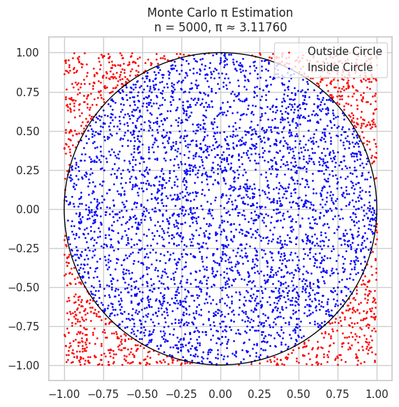

# Problem 2
#  Estimating π Using Monte Carlo Methods

##  Motivation

Monte Carlo simulations use randomness to estimate numerical values or solve mathematical problems. One of the most elegant applications of Monte Carlo methods is estimating the value of π through **geometric probability**.

This exercise demonstrates how π can be approximated through:
- The **circle-inside-a-square method**
- The classical **Buffon's Needle problem**

These simulations connect core ideas from **geometry**, **probability**, and **numerical computation**.

---

## PART 1: Estimating π Using a Circle

###  1. Theoretical Foundation

We place a unit circle inside a square of side length 2:

- Circle area:  
  $$
  A_{\text{circle}} = \pi r^2 = \pi
  $$

- Square area:  
  $$
  A_{\text{square}} = (2r)^2 = 4
  $$

Since points are uniformly distributed, the probability that a point falls inside the circle is:  
$$
\frac{A_{\text{circle}}}{A_{\text{square}}} = \frac{\pi}{4}
$$

Thus, we estimate π as:  
$$
\pi \approx 4 \cdot \frac{\text{Number of points inside circle}}{\text{Total number of points}}
$$

---

###  2. Simulation & Code

```python
import numpy as np
import matplotlib.pyplot as plt

def estimate_pi_circle(n_points):
    x = np.random.uniform(-1, 1, n_points)
    y = np.random.uniform(-1, 1, n_points)
    inside = x**2 + y**2 <= 1
    pi_estimate = 4 * np.sum(inside) / n_points
    return pi_estimate, x, y, inside

# Example
n = 5000
pi_val, x, y, inside = estimate_pi_circle(n)
```

# Visualization

# Convergence Analysis 
```python
trials = [100, 500, 1000, 5000, 10000, 50000]
estimates = [estimate_pi_circle(n)[0] for n in trials]

plt.plot(trials, estimates, marker='o', label='Estimated π')
plt.axhline(np.pi, color='red', linestyle='--', label='Actual π')
plt.title("Convergence of π Estimation using Circle Method")
plt.xlabel("Number of Points")
plt.ylabel("Estimated π")
plt.legend()
plt.grid(True)
plt.show()
```