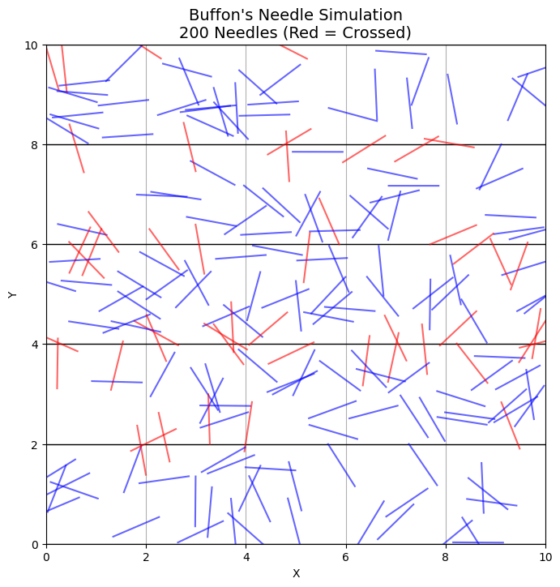

# Problem 2
#  Estimating π Using Monte Carlo Methods

##  Motivation

Monte Carlo simulations use randomness to estimate numerical values or solve mathematical problems. One of the most elegant applications of Monte Carlo methods is estimating the value of π through **geometric probability**.

This exercise demonstrates how π can be approximated through:
- The **circle-inside-a-square method**
- The classical **Buffon's Needle problem**

These simulations connect core ideas from **geometry**, **probability**, and **numerical computation**.

---

## PART 1: Estimating π Using a Circle

###  1. Theoretical Foundation

We place a unit circle inside a square of side length 2:

- Circle area:  
  $$
  A_{\text{circle}} = \pi r^2 = \pi
  $$

- Square area:  
  $$
  A_{\text{square}} = (2r)^2 = 4
  $$

Since points are uniformly distributed, the probability that a point falls inside the circle is:  
$$
\frac{A_{\text{circle}}}{A_{\text{square}}} = \frac{\pi}{4}
$$

Thus, we estimate π as:  
$$
\pi \approx 4 \cdot \frac{\text{Number of points inside circle}}{\text{Total number of points}}
$$

---

###  2. Simulation & Code

```python
import numpy as np
import matplotlib.pyplot as plt

def estimate_pi_circle(n_points):
    x = np.random.uniform(-1, 1, n_points)
    y = np.random.uniform(-1, 1, n_points)
    inside = x**2 + y**2 <= 1
    pi_estimate = 4 * np.sum(inside) / n_points
    return pi_estimate, x, y, inside

# Example
n = 5000
pi_val, x, y, inside = estimate_pi_circle(n)
```

# Visualization


# Convergence Analysis 
```python
trials = [100, 500, 1000, 5000, 10000, 50000]
estimates = [estimate_pi_circle(n)[0] for n in trials]

plt.plot(trials, estimates, marker='o', label='Estimated π')
plt.axhline(np.pi, color='red', linestyle='--', label='Actual π')
plt.title("Convergence of π Estimation using Circle Method")
plt.xlabel("Number of Points")
plt.ylabel("Estimated π")
plt.legend()
plt.grid(True)
plt.show()
```

# Estimating π Using Buffon's Needle Method

## 1. Theoretical Foundation

### 1.1 What is Buffon’s Needle Problem?

Buffon’s Needle is one of the earliest problems in geometric probability, proposed by the French mathematician Georges-Louis Leclerc, Comte de Buffon in the 18th century. The problem asks:

> If you drop a needle of length *L* onto a floor that has parallel lines spaced a distance *D* apart (*L ≤ D*), what is the probability that the needle crosses one of the lines?

Surprisingly, this probability is related to π.

### 1.2 Deriving the Formula

Let:
- *L* be the length of the needle
- *D* be the distance between the parallel lines (with *L ≤ D*)
- *θ* be the acute angle between the needle and the lines (0 ≤ θ ≤ π/2)
- *x* be the distance from the center of the needle to the nearest line (0 ≤ x ≤ D/2)

A needle will cross a line if:

\[
x \leq \frac{L}{2} \sin(\theta)
\]

To find the probability \( P \), we integrate over all possible positions and orientations of the needle:

\[
P = \frac{2L}{\pi D}
\]

Solving for π gives:

\[
\pi \approx \frac{2L \cdot N}{D \cdot C}
\]

Where:
- *N* is the total number of needle drops
- *C* is the number of times the needle crosses a line

---

## 2. Simulation

### 2.1 Method

1. Randomly choose a center point of the needle between 0 and *D/2* (since the problem is symmetric).
2. Randomly generate an angle θ between 0 and π/2.
3. Check if the needle crosses a line using:

\[
x \leq \frac{L}{2} \sin(\theta)
\]

4. Count how many times this condition is satisfied.
5. Estimate π using:

\[
\pi \approx \frac{2L \cdot N}{D \cdot C}
\]

---

## 3. Python Implementation

```python
import numpy as np
import matplotlib.pyplot as plt

def buffon_needle_simulation(N, L=1.0, D=2.0):
    assert L <= D, "Needle length must be less than or equal to line spacing"
    
    # Random needle center distances from nearest line
    x = np.random.uniform(0, D / 2, N)
    # Random angles between 0 and π/2
    theta = np.random.uniform(0, np.pi / 2, N)
    
    # Check if the needle crosses a line
    crosses = x <= (L / 2) * np.sin(theta)
    C = np.count_nonzero(crosses)
    
    if C == 0:
        return np.nan  # Avoid division by zero
    else:
        pi_estimate = (2 * L * N) / (D * C)
        return pi_estimate, crosses

# Example usage
N = 10000
pi_est, crosses = buffon_needle_simulation(N)
print(f"Estimated π with {N} trials: {pi_est}")
```
