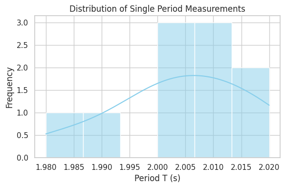

# Problem 1
# Problem 1: Measuring Earth's Gravitational Acceleration Using a Pendulum

## Motivation

The acceleration due to gravity \( g \) is a cornerstone of classical mechanics.  
A **simple pendulum** offers an elegant method to estimate \( g \) experimentally, using time measurements of oscillations.

This experiment emphasizes:

- Accurate measurement techniques  
- Statistical uncertainty analysis  
- Comparison of experimental vs theoretical \( g \) values  

---

## Materials

- String: 1.0–1.5 m  
- Weight: key, coin, nut, etc.  
- Stopwatch or smartphone  
- Measuring tape (with known resolution, e.g., 1 cm)  

---

## Experimental Setup

1. Attach the weight to the string and suspend it from a stable point.  
2. Measure the **total length \( L \)** from the suspension point to the **center of mass** of the weight.  
3. Displace the pendulum by a small angle (<15°) and release.  
4. Measure time \( T_{10} \) for **10 full oscillations**, and repeat this **10 times**.  
5. Record data and perform statistical analysis.

---

## Data Table

| Trial | \( T_{10} \) (s) | \( T \) (s) = \( \frac{T_{10}}{10} \) |
|-------|------------------|---------------------------------------|
| 1     | 20.1             | 2.01                                  |
| 2     | 19.9             | 1.99                                  |
| 3     | 20.0             | 2.00                                  |
| 4     | 20.2             | 2.02                                  |
| 5     | 20.0             | 2.00                                  |
| 6     | 20.1             | 2.01                                  |
| 7     | 20.0             | 2.00                                  |
| 8     | 20.1             | 2.01                                  |
| 9     | 19.8             | 1.98                                  |
| 10    | 20.2             | 2.02                                  |

---

## Summary Statistics

- Mean period:

$$
\bar{T} = \frac{1}{n} \sum_{i=1}^{n} T_i = 2.0040 \ \text{s}
$$

- Standard deviation:

$$
\sigma = \sqrt{ \frac{1}{n - 1} \sum_{i=1}^{n} (T_i - \bar{T})^2 } = 0.0126 \ \text{s}
$$

- Uncertainty in the mean period:

$$
\delta \bar{T} = \frac{\sigma}{\sqrt{n}} = 0.0040 \ \text{s}
$$

These results indicate that the measurements are quite consistent.  
The low standard deviation and uncertainty demonstrate that the data is reliable.

---

## Calculations

### 1. Gravitational Acceleration

Using the formula for a simple pendulum:

$$
T = 2\pi \sqrt{\frac{L}{g}} \Rightarrow g = \frac{4\pi^2 L}{T^2}
$$

Plugging in values:

- \( L = 1.000 \ \text{m} \)
- \( \bar{T} = 2.0040 \ \text{s} \)

We get:

$$
g = \frac{4\pi^2 \cdot 1.000}{(2.0040)^2} \approx 9.8367 \ \text{m/s}^2
$$

---

### 2. Propagation of Uncertainty

Let:

- \( \delta L = 0.005 \ \text{m} \)  
- \( \delta \bar{T} = 0.0040 \ \text{s} \)

Then:

$$
\delta g = g \cdot \sqrt{ \left( \frac{\delta L}{L} \right)^2 + \left( 2 \cdot \frac{\delta \bar{T}}{\bar{T}} \right)^2 }
$$

$$
\delta g \approx 9.8367 \cdot \sqrt{ \left( \frac{0.005}{1.000} \right)^2 + \left( 2 \cdot \frac{0.0040}{2.0040} \right)^2 } \approx 0.0614 \ \text{m/s}^2
$$

### Final Result:

$$
g = 9.84 \pm 0.06 \ \text{m/s}^2
$$

---

## Python Code

```python
import numpy as np

# Measured times for 10 oscillations (in seconds)
T10 = np.array([20.1, 19.9, 20.0, 20.2, 20.0, 20.1, 20.0, 20.1, 19.8, 20.2])
L = 1.000  # pendulum length in meters
delta_L = 0.005  # uncertainty in length

# Calculations
T_single = T10 / 10
T_mean = np.mean(T_single)
sigma = np.std(T10, ddof=1)
delta_T10 = sigma / np.sqrt(len(T10))
delta_T = delta_T10 / 10

# Gravity and uncertainty
g = 4 * np.pi**2 * L / T_mean**2
delta_g = g * np.sqrt((delta_L / L)**2 + (2 * delta_T / T_mean)**2)

print(f"Mean T = {T_mean:.4f} s")
print(f"g = {g:.4f} m/s² ± {delta_g:.4f}")
```